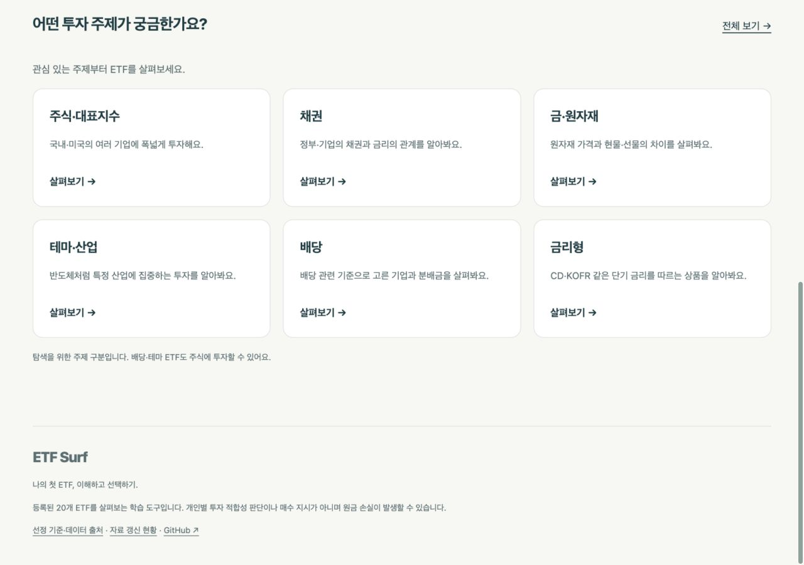
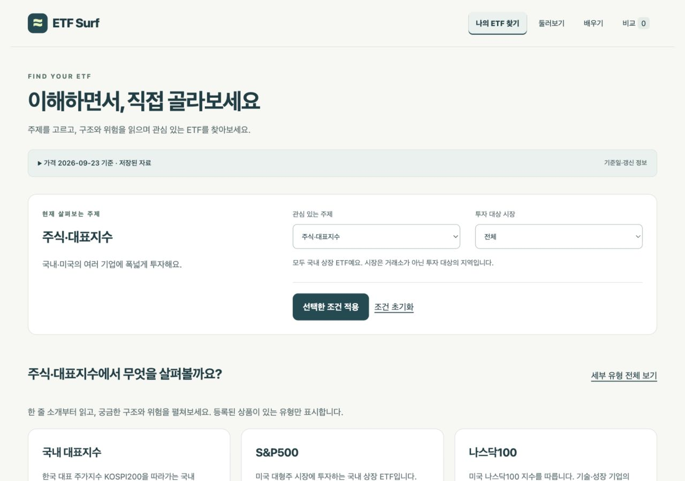

# ETF Surf

**나의 첫 ETF, 이해하고 선택하기.** 국내 상장 ETF 20개를 탐색하고, 상품의 특성과 근거자료를 읽은 뒤 비교하는 입문자용 웹사이트입니다.

[공개 사이트](https://wjyi0615.github.io/etf-surf/) · [배포 기록](https://github.com/wjyi0615/etf-surf/actions/workflows/pages.yml) · [가격 갱신 기록](https://github.com/wjyi0615/etf-surf/actions/workflows/update-prices.yml)

공개 사이트는 `main` 기준이며 GitHub Pages로 배포합니다. 현재는 검증된 20개 상품을 다루며, 국내 상장 ETF 전체를 수록한 서비스는 아닙니다.

## 화면 미리보기

2026-09-27 로컬 실행 화면입니다. 화면 속 기준일과 수치는 촬영 당시의 저장 자료입니다.





## 이용 흐름

**관심 주제 → 세부 유형 → 상품 상세 이해 → 근거자료 확인 → 최대 3개 비교**

- **홈:** 주식·대표지수, 채권, 금·원자재, 테마·산업, 배당, 금리형의 여섯 탐색 입구. 원본 상품 분류와 구분합니다.

- **둘러보기:** 상품명·운용사·종목코드 검색, 자산 종류·세부 유형·투자 시장 필터. 기본정보와 가격 수익률 목록을 전환합니다.
- **상품 상세:** 투자 대상 → 영향 요인 → 주요 위험 → 구성자료·기준일 순서로 설명합니다. 같은 지수 상품의 비용·환헤지·분배 방식·구성은 확인된 자료만 비교하고 나머지는 미확보로 표시합니다.
- **비교:** 선택 상품의 공통 거래일로 최근 1년 가격 흐름·수익률·최대낙폭을 계산하고 비용·규모를 함께 확인합니다.
- **나의 ETF 찾기:** 홈에서 고른 주제를 유지하며 시장·세부 유형을 좁힙니다. 설명 카드에서 구조와 위험을 펼치고 일치하는 상품을 확인합니다. 선택 조건은 URL에 보관되어 새로고침과 뒤로 가기에도 유지됩니다. 설문 기반 개인별 후보 선정은 중단했습니다.
- **자료 현황:** 가격 기준일 안내·상품 상세·하단에서 접근합니다. 상품명·코드 검색과 상태 필터, 20개 단위 페이지를 제공합니다.
- **학습·시나리오:** ETF 기초 설명과 과거 월 적립식 투자 계산을 제공합니다.

모든 상품은 국내 상장 ETF입니다. ‘미국’ 필터는 미국 상장이 아니라 투자 대상 시장을 뜻합니다. 등록 범위는 국내 대표지수, S&P500, 나스닥100, 국내·미국 배당, 국고채, 단기채, CD·KOFR 금리형, 금 선물, 반도체입니다.

## 로컬 실행

HTML·CSS·JavaScript와 Python 표준 라이브러리를 사용합니다. 별도 패키지 설치, API 키, 빌드 과정이 없습니다.

```sh
python3 -m http.server 8000
```

[로컬 사이트](http://localhost:8000/docs/)에 접속합니다. `docs/index.html`을 직접 열어도 동작하지만 브라우저 정책에 따라 로컬 파일 접근이 제한될 수 있습니다.

```sh
node tests/surf.cjs
python3 -m unittest discover -s tests -p 'test_*.py' -v
node --check docs/app.js
node --check docs/rules.js
node scripts/audit_data.cjs > /tmp/etf-data-health.json
```

검증 범위는 설문 81개 답변 조합, 후보 규칙, 상품 필터·상세 연결, 공통 기간 계산, 자료 부족 처리와 가격 갱신 실패 시 보존입니다.

## 데이터와 계산 기준

자료 관리 화면은 `#/data`에서 확인합니다. 상품별 출처·기준일·확인일을 표시하며 미확보/날짜 확인 필요/재확인 필요를 구분합니다. `node scripts/audit_data.cjs`는 같은 정책의 JSON 보고서를 출력합니다. 수동 갱신 절차와 기준은 [DATA-MAINTENANCE.md](DATA-MAINTENANCE.md)를 참고하세요. 기존 자료 자체를 최신으로 바꾼 것은 아닙니다.

| 자료 | 출처·관리 방식 |
| --- | --- |
| 일별 종가·거래량 | NAVER 저장 자료. 상품별 관측일과 가격 이력을 보관합니다. |
| 총보수·순자산·상장일 | 운용사·거래소 공식 자료를 수동 확인합니다. 항목별 출처·기준일·확인일을 표시합니다. |
| 분배금 | 일부 상품의 일부 지급 내역만 확보했습니다. 전체 이력이 아닙니다. |
| 최신 상태 | 사이트의 가격 기준일·갱신 상태와 Actions 실행 기록에서 확인합니다. |

- 가격 수익률은 `마지막 가격 / 시작 가격 - 1`, 최대낙폭은 `min(각 가격 / 당시까지 최고 가격 - 1)`입니다.
- 최근 1년은 마지막 관측일의 12개월 전 이하에서 가장 가까운 종가를 기준으로 합니다. 비교에는 모든 선택 상품에 존재하는 거래일만 사용합니다.
- 분배금 재투자·세금·매매비용은 반영하지 않습니다. 공급자 가격 조정 이력을 독립 검증하지 않아 총수익률로 해석할 수 없습니다.
- 보수·순자산은 서로 다른 시점의 자료이며 오래된 항목도 있습니다. 미확보 값을 0으로 대체하지 않습니다.
- NAV·추적오차·호가 스프레드는 제공하지 않습니다. 서로 다른 지수의 수익률 차이를 운용 능력 순위로 해석하지 않습니다.
- 월 투자 시나리오는 12·36·60회 납입을 지원합니다. 매월 첫 관측 종가로 정수 단위 매수하고 잔여 현금을 이월합니다. 이력이 부족하면 계산하지 않습니다.

## 정보 제공 범위

설문 기반 개인별 상품 추천은 중단했습니다. `/questionnaire`와 `/result` 직접 접속도 안내만 표시합니다. 사용자가 선택한 상품 조건으로 검색·비교하며 투자 적합성, 매수·매도 시점, 투자 비중을 판정하지 않습니다. 기존 추천 로직은 회귀 테스트용으로 남아 있지만 공개 라우터에는 연결하지 않습니다.

같은 지수 비교는 지수·자산 종류·지역·전략·상품유형이 일치하는 등록 상품을 연결합니다. 비교 선택은 메모리에만 보관합니다. 로그인·주문·계좌 연결·유료 자문은 없습니다.

이번 조치가 법적 적합성을 보장하지 않습니다. 운영 및 데이터 재배포 관련 미해결 사항은 [LEGAL-REVIEW.md](LEGAL-REVIEW.md)에 기록했습니다.

## 자동 갱신과 배포

- `Refresh ETF Surf prices`: 평일 한국시간 19:23 예약 실행. GitHub 예약 작업은 지연될 수 있습니다.
- 가격 갱신은 등록 상품 전체를 검증한 뒤 파일을 교체합니다. 실패하면 마지막 정상 가격을 보존하고 실패 상태를 표시합니다.
- 가격 수집은 기본 정보와 분배금의 확인일을 갱신하지 않습니다.
- `Deploy ETF Surf`: `main` 변경, 가격 갱신 작업 완료 또는 수동 실행 시 테스트 후 `docs/`를 GitHub Pages에 배포합니다.
- 수동 데이터 수집: `python3 scripts/update_prices.py`.

## 파일 구성

```text
docs/
  index.html / app.js / style.css  # 화면·탐색·상세·비교
  rules.js                        # 후보 규칙·상품 가이드·성과 계산
  data-core.js                    # 데이터 검증·필터·계산
  prices.js / fundamentals.js     # 가격·기본 정보·일부 분배금
  update-status.js                # 최근 수집 상태
scripts/update_prices.py          # 가격 갱신
scripts/audit_data.cjs            # 수동 자료 출처·날짜 점검 보고서
docs/data-health.js               # 화면과 보고서가 공유하는 점검 정책
docs/screenshots/                 # README 실제 화면
DATA-MAINTENANCE.md               # 자료 갱신 운영 절차
tests/                           # JavaScript·Python 검증
.github/workflows/                # 데이터 갱신·Pages 배포
```

## 브랜치 운영

`main`은 공개 사이트 기준이며 작업은 `codex/` 브랜치에서 진행합니다. 변경 검증 → PR → 병합 → 배포 확인 순서로 반영하고, 병합 완료 브랜치는 정리합니다. 미병합 작업과 별도 이력의 로컬 보관 브랜치는 병합 여부 확인 없이 삭제하지 않습니다.

## ETF 구성자료

20개 상품 모두 구성자료 영역을 제공합니다. 17개는 공식 자료의 일부 편입 항목·비중, 국고채3년·KOFR·CD 3개는 공식 문서의 투자 구조 설명입니다. 구조 설명을 실제 보유 비중표로 표시하지 않습니다. 구성자료는 2021~2026년의 서로 다른 시점이며 현재 포트폴리오가 아닙니다. 기준일·확인일·원문 링크를 표시하고 가격 자동 수집과 별도로 수동 관리합니다. 다른 운용사의 같은 지수 ETF 비중을 복제하지 않습니다.

## UI 작업 검증

탐색 검색·유형·시장·목록 보기 선택은 URL에서 복원됩니다. 비교 선택과 설문 답변은 기존 정책대로 열린 페이지의 메모리에만 유지합니다. 비교 선택 시 펼친 설명과 작성 중인 입력을 유지하며 모바일에서는 설명 카드를 한 열로 표시합니다. `DESIGN.md`와 `UX-CONTRACT.md`에 공용 화면·동작 기준을 기록했습니다.

검증 명령은 `premium-ui.json`, 실행 결과와 정적 감사 한계는 `UI-VERIFICATION.md`를 참고하세요.
